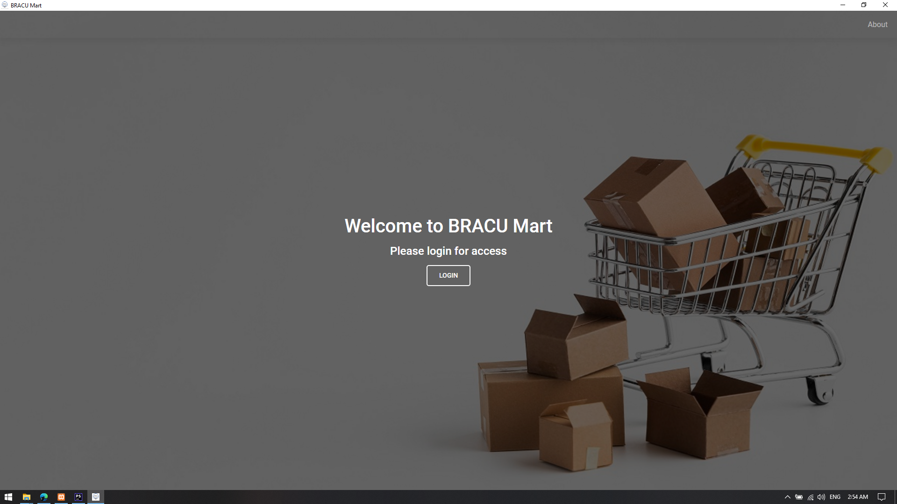
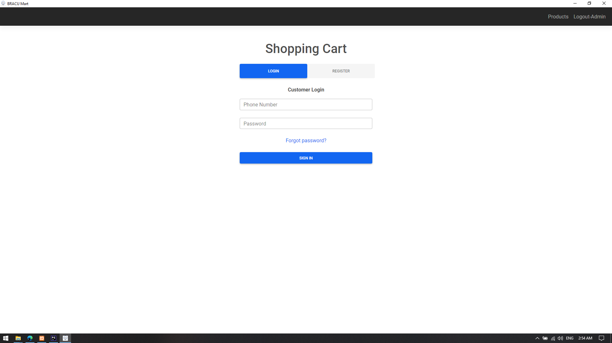
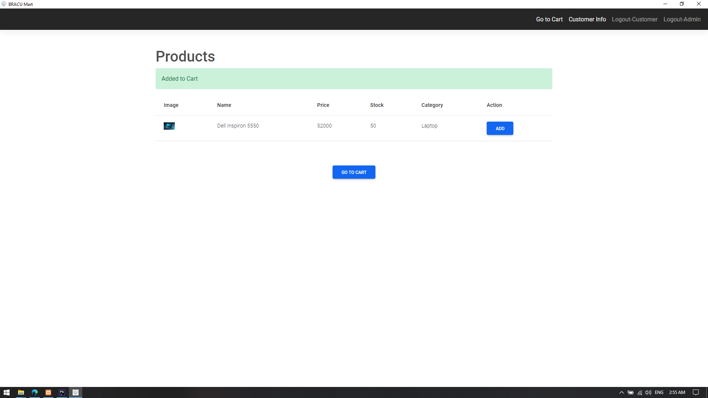
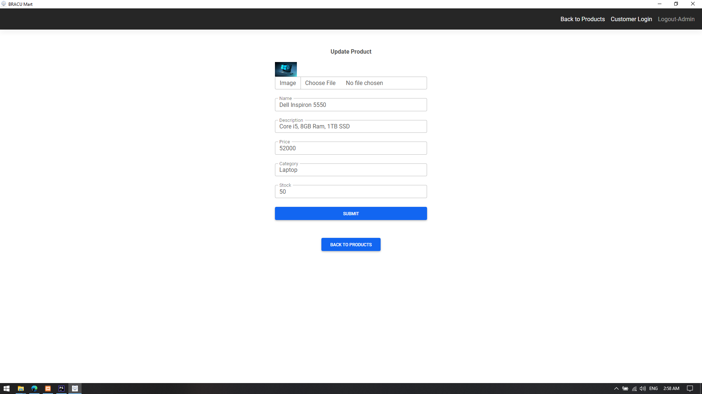
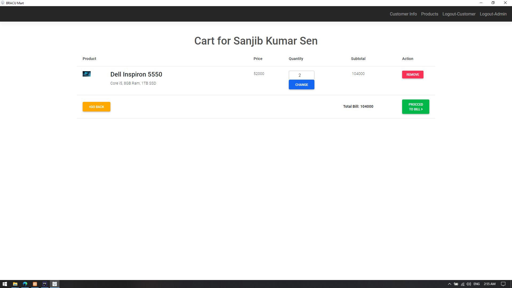
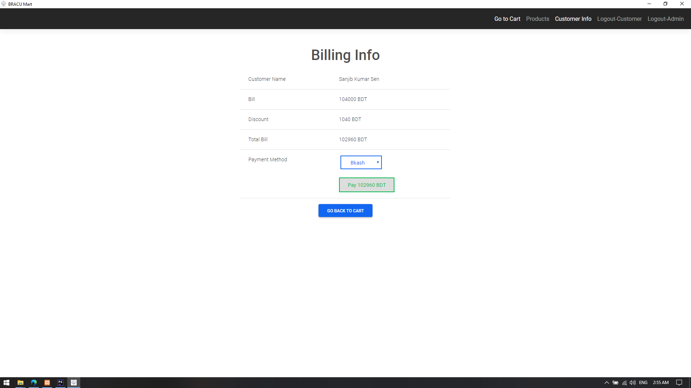
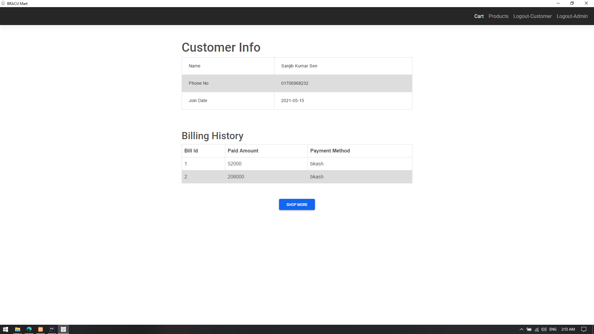
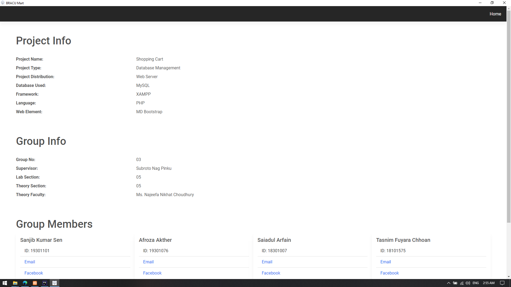

# Shopping Cart

## About this Project
A database Project for CSE370 Course. This is a basic Shopping Cart Management Solution app called BRACU Mart.

## Before You Start:
There are 2 ways to run this app solution.
* As a Web-Server (Requiring a Browser)
* As a Desktop App (An executable file for Windows)

## Requirements:
* Windows, but if you are geek enough, you should manage to run this on Linux
* Download and Install [Xampp](https://www.apachefriends.org/xampp-files/8.0.6/xampp-windows-x64-8.0.6-0-VS16-installer.exe)

## How to Run:
### For Desktop App: (Recommended)
1. Download [this zip file](https://github.com/sanjib-sen/Project-ShoppingCart/releases/download/0.01/BRACU.Mart.zip).
2. Extract it.
3. Open **Xampp** start `Apache` and `MySQL` Server.
4. Open `BRACU Mart.exe`.
5. Login with this Admin Credentials:
    * **Username:** `sanjib`
    * **Password:** `1234`

### For Web App:
1. Git Clone this Repository or Download the zip file and extract it.
2. Rename the `Project-ShoppingCart` folder as your wish. For example: `bracu-mart`
3. Copy the folder to `<xampp installation directory>/htdocs` . e.g. `C:/xampp/htdocs`.
4. Open **Xampp** start `Apache` and `MySQL` Server.
5. Now with your browser visit:
   `localhost/<your-folder-name>` e.g. `localhost/bracu-mart`
6. Login with this Admin Credentials:
   * **Username:** `sanjib`
   * **Password:** `1234`
   

## Features:

#### Admin
* Admin Login and logout

#### Products
* Create Delete Update Product
* Add and Update Image to Product
* Automatically Delete previous Image when Update a new image
  
#### Cart
* Add Product to Cart
* Increase Product Quantity in cart
* Show Product and Unit Price 
* Show Total Bill

#### Billing
* Show Billing Information
* Apply Loyalty Discount
* Show Total Price
* 5 Options to choose for payment
   * Bkash
   * Nagad
   * Rocket
   * Card
   * Cash
* Save Billing Information to Customer Profile

#### Customer
* Customer Registration, Login and Logout.
* Customer Profile Information and Billing History.
* Customer Reset Password.

## Screenshots

#### Index Page:

#### Customer Login:

#### Products:

#### Update Product:

#### Cart:

#### Billing:

#### Customer Info:

#### About Page:
